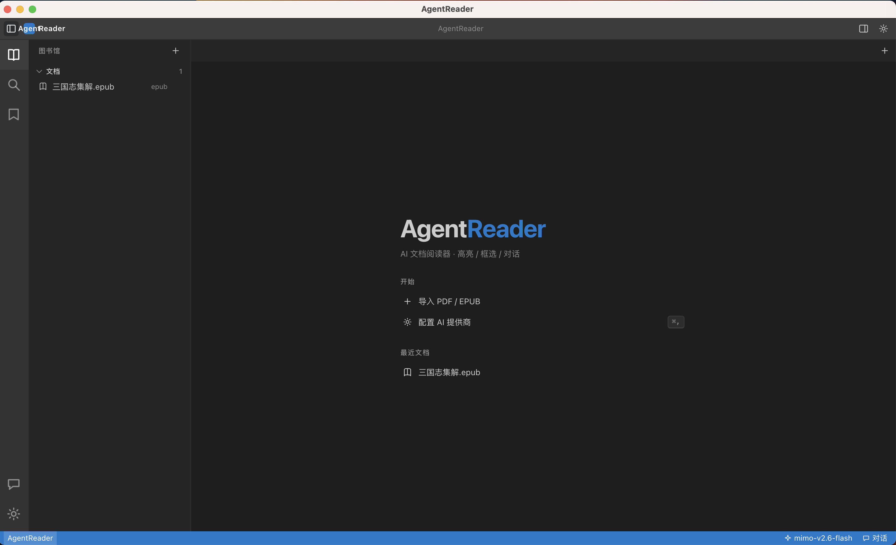
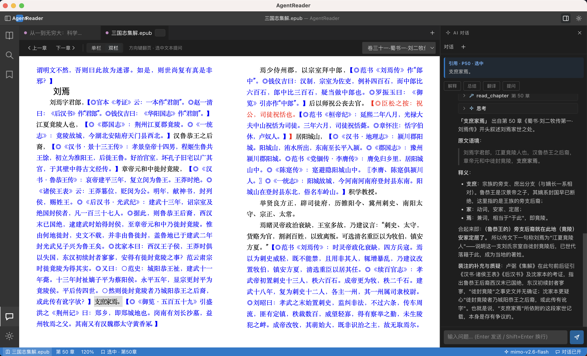

# AgentReader

English | [简体中文](README.zh.md)

A desktop AI document reader with PDF / EPUB import, reading, **highlight / rectangle selection**, and AI chat. Inspired by `Reference/pi` — small but complete.

## Screenshots





## Features

- **Library**: import-based management under `library/{hash}/`, one folder per document (original file + `doc.json` + `annotations.json` + `chats.jsonl`)
- **Reading**: PDF.js `canvas + textLayer` with paging / zoom / text selection; EPUB (v0.2)
- **Annotation**: text highlight + modifier-drag rectangle selection (macOS `⌥`, other platforms `Alt`), persisted as normalized coordinates
- **AI chat**: sidebar, auto-injects the current selection as a citation, graded context (selection / chapter / full-text RAG), streaming output
- **Multi-provider**: reimplements `pi-ai`'s `Model / Context / StreamFn`, OpenAI-compatible endpoints

## Tech stack

- Electron + Vite + React + TypeScript
- `packages/ai`: multi-provider abstraction (OpenAI-compatible)
- `packages/agent`: AgentLoop + `SessionManager` (JSONL)
- `packages/app`: main process (IPC / library / vector / OCR) + renderer (PDF / annotations / chat)

## Quick start

```bash
nvm use 22.23.2        # requires Node >=22.19.0
npm install            # a proxy/mirror is needed to download the Electron binary
# proxy example: https_proxy=http://127.0.0.1:7890 npm install
# mirror example: ELECTRON_MIRROR="https://npmmirror.com/mirrors/electron/" npm install

npm run dev            # Electron + Vite
# renderer only (no Electron):
npm run dev:web --workspace=@agentreader/app
```

Set the API key: after launch, open `Settings` in the sidebar and fill in `Base URL / Model / API Key`.

## Packaging

Build a macOS app (`.app`) or installer (`.dmg`) from `packages/app`:

```bash
# .app only (unsigned, fastest to verify)
npm run package:dir --workspace=@agentreader/app   # -> out/mac-arm64/AgentReader.app

# .dmg installer
npm run package --workspace=@agentreader/app       # -> out/AgentReader-<version>-arm64.dmg
```

Artifacts land in the repo-root `out/` directory. Packaging is currently **arm64 only** and **unsigned** (`identity: null` in `packages/app/electron-builder.json`). On first launch macOS Gatekeeper may block the unsigned app — right-click → Open, or:

```bash
xattr -dr com.apple.quarantine /Applications/AgentReader.app
```

## Docs

- `docs/requirements.md` requirements
- `docs/plan.md` plan
- `docs/plan-v0.2.md` providers / multi-model / web search / skills plan
- `docs/progress.md` progress log
- `Reference/pi` reference project (gitignored, not committed)

## Layout

```
AgentReader/
├── docs/
├── packages/
│   ├── ai/         # multi-provider
│   ├── agent/      # AgentLoop + sessions
│   └── app/        # Electron main / renderer / preload
└── Reference/      # reference (ignored)
```

## Roadmap

- Phase 1 MVP: PDF + annotations + sidebar chat + library
- Phase 2: EPUB + RAG + multi-provider
- Phase 3: dual-track OCR (scanned documents) + export + extensions

## License

Licensed under the [Apache License 2.0](LICENSE).
